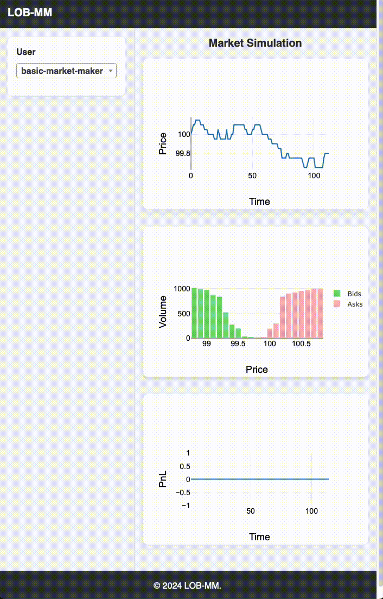

# Limit Order Book Market Making
This project implements a limit order book matching engine and a market maker agent in Python. The engine simulates a dynamic market environment by processing randomly incoming limit orders, market orders, and optionally IOC orders. The resulting mid-price exhibits behavior similar to a Brownian motion. The market maker agent continuously places quotes around the mid-price to provide liquidity.

## How to Run

Make sure to have both Python (e.g., version 3.12.3) and `pip` installed. Open the root directory of this project in your terminal and run the following command to install all required packages:

```sh
pip install -r requirements.txt
```

Next, to run the simulation along with the market maker, run the following command:

```sh
python src/main.py
```

Finally, open the link to your local server (http://localhost:5001) in a browser to see the market simulation in action.

## Project Structure
The project source code is structured as follows:

- `src/exchange.py`: Contains the implementation of the the market simulation server that runs on a limit order book matching engine.

- `src/marketmaker.py`: Contains the implementation of the market maker agent.

- `src/main.py`: Runs both the market simulator and the market maker simultaneously.

## Result
The GIF below depicts an example simulation run of the market maker on the limit order book.


